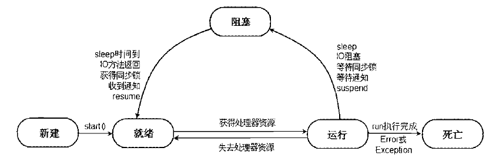

# 线程的生命周期
> 线程的生命周期包括**5大状态**：新建（New）、就绪（Runnable）、运行（Running）、阻塞（Blocked）、死亡（Stop）.
>
>> 5个状态可以分成两类：
>>
>> 1. **静态**：新建（New）、死亡（Stop）.
>> 2. **动态**：就绪（Runnable）、运行（Running）、阻塞（Blocked）.

<br><br>

## 目录

1. [新建（New）：内存中](#一新建new内存中--)
2. [就绪（Runnable）：就绪队列中](#二就绪runnable就绪队列中--)
3. [运行（Running）：CPU中](#三运行runningcpu中--)
4. [阻塞（Blocked）：阻塞队列中](#四阻塞blocked阻塞队列中--)
5. [死亡（Stop）：内存中](#五死亡stop内存中--)
6. [检查线程是否活跃（动静态检测）：isAlive](#六检查线程是否活跃动静态检测isalive--)
7. [线程生命周期状态转换图](#七线程生命周期状态转换图)
8. [可人为参与的线程调度活动总结](#八可人为参与的线程调度活动总结)

<br><br>

### 一、新建（New）：内存中  [·](#目录)

<br>

- 即**new出一个Thread对象**后的即时状态.
   - 就跟普通Java对象（String、Integer等）被new出时一样，仅仅就是**开了一个Java对象内存空间**而已.
   - 此时仅仅就是一个 **静态的** 数据对象，和String对象等没有任何区别.

<br><br>

### 二、就绪（Runnable）：就绪队列中  [·](#目录)
> 即 **调用start方法之后** 的 **即时状态**.
>
>> 该状态下线程所处的环境是 **JVM内核的线程调度器的就绪队列**.

<br>

- 此时线程已经拥有 **动态性**：
   1. 准备就绪，**被放入就绪队列中等待运行**，随时都可以运行.
   2. JVM已经为其创建好**函数栈**和**程序计数器**.
   3. 但**并未运行**，只是**被动地**等待**JVM内核的线程调度器**调度它.
      - 具体哪个时间点扔进CPU运行**不由开发者编程决定**.
      - 而是 **自动地**、**被动地** 听从 **JVM内核的线程调度器** 的安排.
         - 验证只是就绪并没有立即运行的方法：
            - 可以在start调用语句之后紧跟一行输出语句.
            - 可以发现有时候start后面的输出语句会比run中输出的更早.
         - 因此，如果想在start后立马开始执行run就可以在start调用语句后紧跟一个Thread.sleep(mili).

<br>

- 注意：**启动线程不能用run，必须用start**
   1. start会向**JVM内核的线程调度器**发送就绪信号，而run不会.
      - start由本地方法实现（JVM内核信号传递功能），可以调动线程调度器.
      - run只是一个可以自己重写的普通方法.
   2. 因此不start就直接调run就相当于在当前线程中**执行了一个普通方法**. （**仍然是单线程**）
      - 并不会让线程调度器把自己当成一个多线程来调度.
   3. start只能调用一次，多于一次就会抛出 **[IllegalThreadStateException]线程状态异常**.

<br><br>

### 三、运行（Running）：CPU中  [·](#目录)
> 运行态的上一个状态 **必定只能是就绪态**.
>
>> 只要CPU空闲就会从就绪队列中挑一个放进去运行.
>>
>> - **怎么挑由调度器决定，不能人为控制**.

<br>

- 在就绪后（start之后），不知何时（由JVM内核线程调度器决定）从就绪队列中挑出来送入CPU运行的状态.
   - 该状态下线程所处的环境是 **CPU**.
   - 必然是 **动态** 的.

<br>

- **是和其它线程一起并发式运行.**

<br><br>

### 四、阻塞（Blocked）：阻塞队列中  [·](#目录)
> **运行态** 的线程因为某些原因 **被暂停了**，然后 **暂时搁置** 在线程队列中等待下次被唤醒.
>
>> 该状态下线程所处的环境同样（**和就绪态一样**）是 **JVM内核的线程调度器的阻塞队列**.

<br>

- 只能从运行态进入阻塞状态.
   - 即 **阻塞态之前一定是运行态**.
      - CPU暂时转去处理其它更重要的任务.

<br>

- **阻塞态的下一个状态必定是就绪态：**
   - 毕竟，被阻塞线程迟早是要接着运行的，但不会立马就会从阻塞状态进入运行状态.
   - 而是在**适当的时机**被调度器从阻塞队列中拿出去放入就绪队列中就绪.

<br>

- 进入阻塞状态原因：
   1. 线程自己主动调用sleep.
      - 睡完之后进入就绪队列.
   2. 在占用一个IO资源时，其它地方调用了**阻塞式IO方法**强行抢夺了该IO资源.
      - CPU转去处理那个IO操作了.
      - 阻塞式IO完毕之后进入就绪队列.
   3. 线程试图访问正在被其它线程占用的临界资源（同步监视器）.
      - 因此被阻塞，等待该资源访问权的归还.
      - 其它线程占用完毕后进入就绪队列竞争优先权.
   4. 当前线程在访问临界资源（同步监视器）时，**被临界资源wait掉了**.
      - 从而交出临界资源的访问权给其它要访问它的线程，暂时被搁置.
      - 在阻塞程队列中静静等待被重新唤醒（notify），唤醒后进入就绪队列.
   5. 其它地方调用该线程的suspend方法将其强行挂起.
      - 但这个方法**容易导致死锁**，**尽量不要用**.
      - 其它地方主动调用它的resume方法让它进入就绪队列.

<br>

- 注意：如果调用了线程对象的yield方法**会从运行状态直接进入就绪状态**而**不是阻塞状态**.
   1. yield是让步的意思.
   2. 因此可以理解为**阻塞是大让步**，**yield是小让步**.
   3. 因此**被yield的线程的重要性（优先级）一般比被阻塞的线程要大**.

<br><br>

### 五、死亡（Stop）：内存中  [·](#目录)
> 只能从运行态到死亡态，**死亡态的上一个状态只能是运行态**.

<br>

- 死亡时机：
   1. 自然死亡：run/call正常执行完毕.
   2. 异常死亡：线程在执行过程中抛出了无法处理或未捕获的异常被强制死亡（但父进程没退出）.
   3. 手动枪毙：直接手动调用线程对象的stop方法（但父进程没退出）.
      - public final void stop();  // Thread的对象方法
      - 但这种方法**容易导致死锁**，并不推荐.

<br>

- 线程死亡后就仅仅是内存中的一块儿“肉”了（和普通的Java对象，如String等，没任何区别）.
   - 留着它唯一的作用就是**想要得到线程执行完毕后的计算结果**.
   - 结果取到后回收即可.

<br><br>

### 六、检查线程是否活跃（动静态检测）：isAlive  [·](#目录)
> 调用线程对象的isAlive方法检测.

<br>

```Java
/**   Thread的对象方法
 *  
 *    1. 当线程处于静态时（新建、死亡）表示不活跃（返回false）.
 *    2. 当线程处于动态时（就绪、运行、阻塞）表示活跃（返回true）
 */
public final boolean isAlive();
```

<br><br>

### 七、线程生命周期状态转换图：[·](#目录)

<br>

1. 运行到就绪是调用yield.
2. 就绪到运行是：只要CPU空闲就从就绪队列中挑一个线程运行.



<br><br>

### 八、可人为参与的线程调度活动总结：[·](#目录)

<br>

1. 新建（New）：自己手动new出来一个线程对象.
2. 新建（New）--> 就绪（Runnable）：自己手动调用start.
3. 运行（Running）--> 就绪（Runnable）：自己手动调用yield.
4. 运行（Running）--> 阻塞（Blocked）：主动调用sleep、阻塞式IO、wait、suspend
5. 阻塞（Blocked）--> 就绪（Runnable）：主动调用notify、resume
6. 运行（Running）--> 死亡（Stop）：主动调用Stop

<br>

- 不可人为控制的线程调度活动总结：
   1. 就绪（Runnable）--> 运行（Running）：全部由线程调度器决定.
   2. 运行（Running）--> 阻塞（Blocked）：等待同步锁释放.
   3. 阻塞（Blocked）--> 就绪（Runnable）：sleep完、阻塞式IO完、获得同步锁.
   4. 运行（Running）--> 死亡（Stop）：自然死亡、异常死亡.
