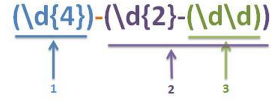

# 捕获组的编号、命名、反向引用

  

## 目录

1. 
2. 
3. 
4. 

  

### 一、捕获组及其编号：
> 之前讲过，捕获组就是 **匹配到的内容** 按照 **( )** 划分成的若干组.

 

- **捕获组的个数**等于**( )出现的个数**.
  - 例如(ab)(cd(ef))就有3个捕获组.

 

- **捕获组编号规则：**
  1. **从1开始计.**
  2. 从左往右按照左括号(出现顺序从小到大编号，例如：

  

### 二、捕获组的命名：
> 如果捕获组的数量非常多，那用数字进行编号将非常混乱.
>
>> 毕竟数字本身没有实际意义，很难帮助记忆每个捕获组的功能.
>>
>>> 因此Java 7开始支持对捕获组命名，通过命名访问或者记忆一个捕获组**更加直观和符合逻辑**.

- 命名语法：**(?\<自定义名\>expr)**
  - 其中外围的 **( )** 定义了一个捕获组，这就不用多说了.
  - 在 **( )** 中必须以 **?\<自定义名\>** 起头表示对该 **( )** 定义的捕获组进行命名.
    - 不以这个起头会引发引擎编译错误.

 

- 是对 **?\<自定义名\>** 后的整个expr表达式（即捕获组命名）.
  - 例如：(?<date>\\d{2}-(\\d\\d))，date是对整个\\d{2}-(\\d\\d)的命名，并不是对紧接的\\d{2}命名.
  - 是对整个()内容命名（以()为单位整体命名）.

         ii. 例如：(?<year>\d{4})-(?<date>\d{2}-(?<day>\d{2}))
             a. 有三个命名捕获组year、date和day
             b. 从左到右编号分别为1、2、3（编号同样是有效的）
    3) 命名捕获组的反向引用：
        i. 正则表达式内引用：\k<捕获组名称>
！例如：(?<year>\d{4})-\k<year>可以匹配1999-1999
        ii. 外部引用：Matcher对象的start、end、group的String name参数指定要查询的捕获组的名称；

4. 普通捕获组和命名捕获组的混合编号：
    1) 普通捕获组是相对命名捕获组的，即没有显式命名的捕获组；
    2) 当所有捕获组都是命名捕获组时那么编号规则和原来相同，即按照左括号(的出现顺序来编号；
    3) 当普通捕获组和命名捕获组同时出现时，编号规则为：先不忽略命名捕获组，只对普通捕获组按照左括号顺序编号，然后再对命名捕获组从左往右累计编号，例如：

！先忽略命名命名捕获组<date>，先对普通捕获组编号\d{4}是1，\d\d是2，然后再接着累加地对命名捕获组编号，因此<date>是3；

### 二、捕获组的反向引用：
> 捕获组的作用就是为了在正则表达式内部或者外部（Java方法中）访问它.
>
>> 这样的访问就称为**反向引用**.
    2) 如何引用？当然是通过前面讲的用捕获组的编号来引用咯！
    3) 正则表达式内部引用：
         i. \X：X是一个十进制数，X的范围必须落在捕获组编号范围之内，该表达式就匹配X号捕获组所匹配到的内容；
         ii. 从上面的描述可以看出，\X匹配的内容是必须X号捕获组匹配成功之后才能确定的！
         iii. 例如：([ab])\1，匹配aabbcc的结果是aa和bb，\1的内容必须要让1号捕获组捕获后才能确定，如果1号捕获的是a那么\1就是a，1号捕获到了b那么\1就是b；
    4) 正则表达式外部引用：就是用Matcher对象的start、end、group查询匹配信息时，使用捕获组编号对捕获组引用（int group）；
