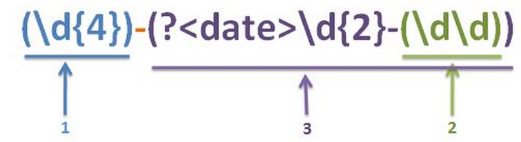

# 捕获组的编号、命名、反向引用

  

## 目录

1. [捕获组及其编号](#一捕获组及其编号)
2. [捕获组的命名](#二捕获组的命名)
3. [普通捕获组/命名捕获组的混合编号问题](#三普通捕获组命名捕获组的混合编号问题)
4. [捕获组的反向引用](#四捕获组的反向引用)

  

### 一、捕获组及其编号：[·](#目录)
> 之前讲过，捕获组就是 **匹配到的内容** 按照 **( )** 划分成的若干组.

 

- **捕获组的个数**等于**( )出现的个数**.
  - 例如(ab)(cd(ef))就有3个捕获组.

 

- **捕获组编号规则：**
  1. **从1开始计.**
  2. 从左往右按照左括号(出现顺序从小到大编号，例如：

  

### 二、捕获组的命名：[·](#目录)
> 如果捕获组的数量非常多，那用数字进行编号将非常混乱.
>
>> 毕竟数字本身没有实际意义，很难帮助记忆每个捕获组的功能.
>>
>>> 因此Java 7开始支持对捕获组命名，通过命名访问或者记忆一个捕获组**更加直观和符合逻辑**.

- 命名语法：**(?\<自定义名\>expr)**
  - 其中外围的 **( )** 定义了一个捕获组，这就不用多说了.
  - 在 **( )** 中必须以 **?\<自定义名\>** 起头表示对该 **( )** 定义的捕获组进行命名.
    - 不以这个起头会引发引擎编译错误.

 

- 是对 **?\<自定义名\>** 后的整个expr表达式（即捕获组命名）.
  - 例如：**(?<date>\\d{2}-(\\d\\d))**，date是对整个 **\\d{2}-(\\d\\d)** 的命名，并不是对紧接的 **\\d{2}** 命名.
  - 是对整个 **( )** 内容命名（以 **( )** 为单位整体命名）.

  

### 三、普通捕获组/命名捕获组的混合编号问题：[·](#目录)
> 如果表达式中的所有捕获组都是命名捕获组的话，编号规则和普通的相同（左括号从左向右编号）.

 

- 两类捕获组混合出现时的编号规则：
  1. 先**忽略掉命名捕获组**，对普通捕获组按照**左括号从左向右编号**.
  2. 接着再对命名捕获组按照**左括号从左向右继续编号**.

  

### 四、捕获组的反向引用：[·](#目录)
> 捕获组的作用就是为了在正则表达式内部或者外部（Java方法中）访问它.
>
>> 这样的访问就称为**反向引用**.
>>
>>> 可以通过**编号**或者**命名**对捕获组反向引用.

 

**1. 在正则表达式内部引用捕获组：**

 

- 通过编号引用：
  - 语法：**\\n**
    1. n是一个十进制数.
    2. 范围**必须落在捕获组编号范围之内**.

 

- 通过命名引用：
  - 语法：**\\k\<捕获组名称\>**

 

**2. 在外部引用捕获组：**

- 当然就是各种Matcher中需要用编号或者名字来访问对象方法咯.
- 例如：matcher.find(int group); matcher.find(String name);

 

**3. 反向引用的匹配规则：**

- 就一句话的规则：**先确定**，再引用
  - 即必须是被引用的那个捕获组的内容已经被确定了之后（即已被完全捕获了之后）才能被引用.
  - 例如：
    - **regex = ([ab])\\1** 去匹配 **aabbcc** ，结果是aa、bb，而**不是aa、ab、bb**.
    - 其匹配过程是这样的：
      1. [ab]先匹配上a，那么\\1就确定为a了，因此，此时regex = aa.
      2. 接着扫描到了ab，此时[ab]还是匹配到了a，因此\\1确定为a，所以regex = aa，**不能匹配ab**.
      3. 接着扫描到了bb，此时[ab]匹配到了b，因此\\1确定为b，所以regex = bb，匹配成功.
        - 所以最终结果为aa、bb.

 

- 同理，对于命名捕获组的匹配规则同样适用：
  - 例如：**(?\<year\>\\d{4})-\\k\<year\>** 去匹配 **1999-1999**

         ii. 从上面的描述可以看出，\X匹配的内容是必须X号捕获组匹配成功之后才能确定的！
         iii. 例如：([ab])\1，匹配aabbcc的结果是aa和bb，\1的内容必须要让1号捕获组捕获后才能确定，如果1号捕获的是a那么\1就是a，1号捕获到了b那么\1就是b；
    4) 正则表达式外部引用：就是用Matcher对象的start、end、group查询匹配信息时，使用捕获组编号对捕获组引用（int group）；

    3) 命名捕获组的反向引用：
        i. 正则表达式内引用：\k<捕获组名称>
！例如：(?<year>\d{4})-\k<year>可以匹配1999-1999
        ii. 外部引用：Matcher对象的start、end、group的String name参数指定要查询的捕获组的名称；
