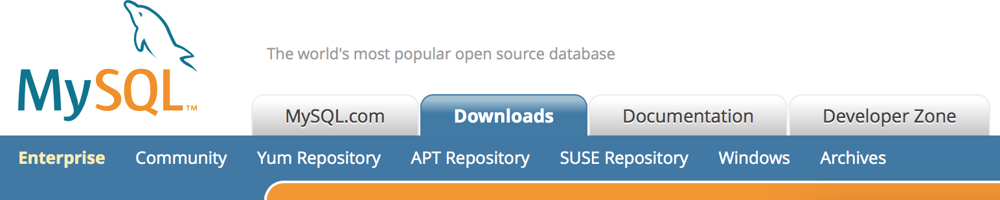
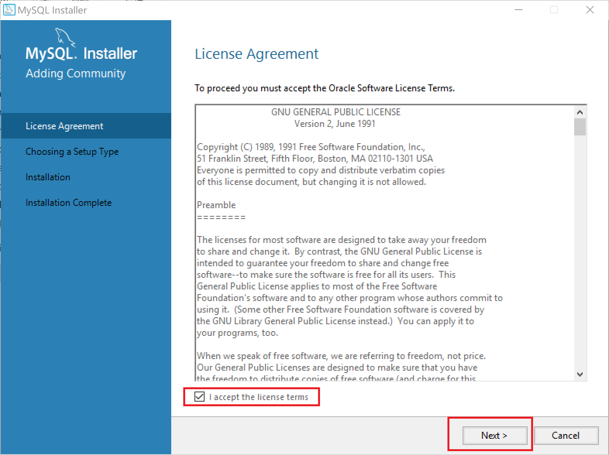
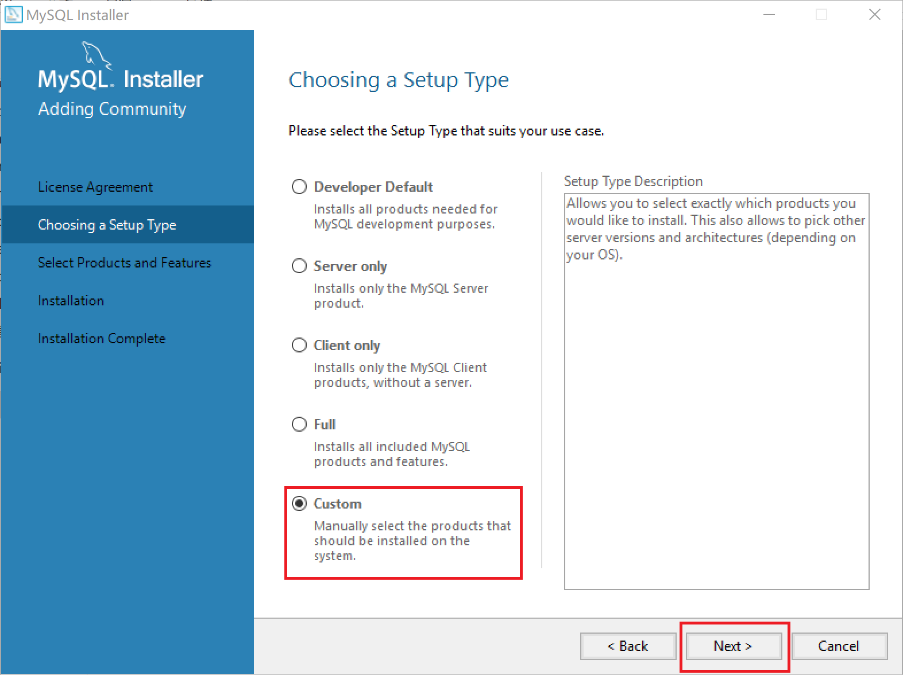
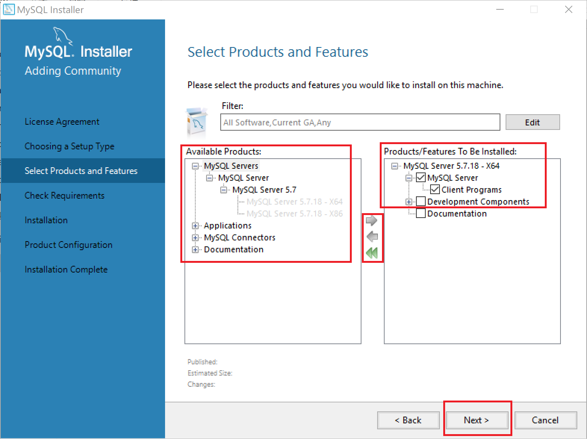
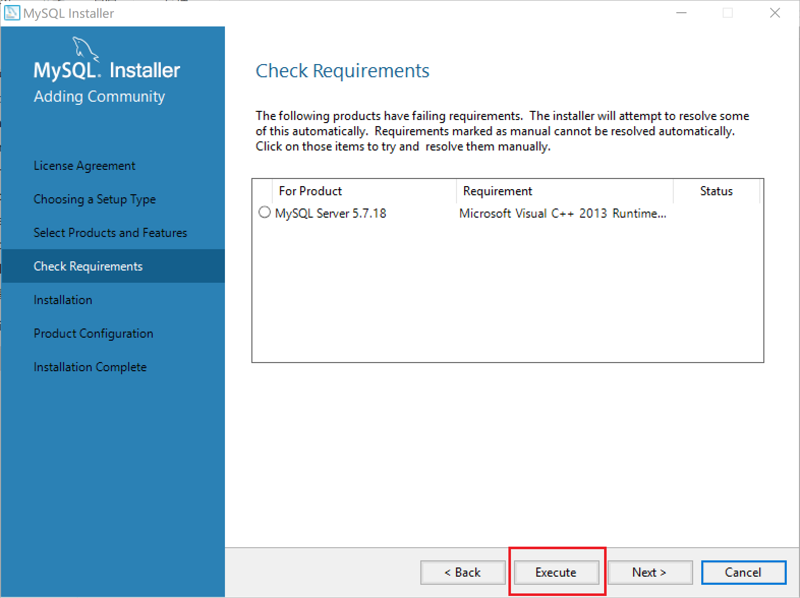
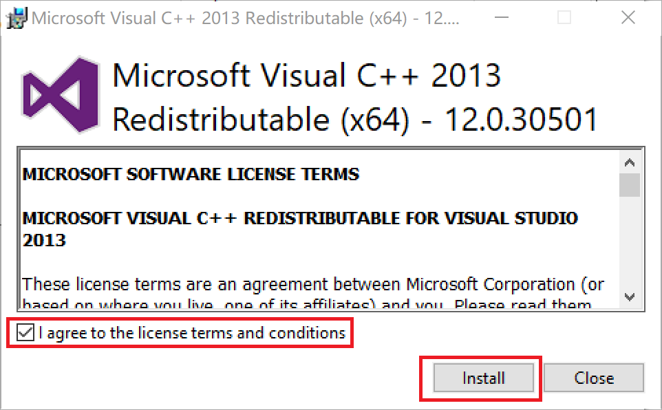
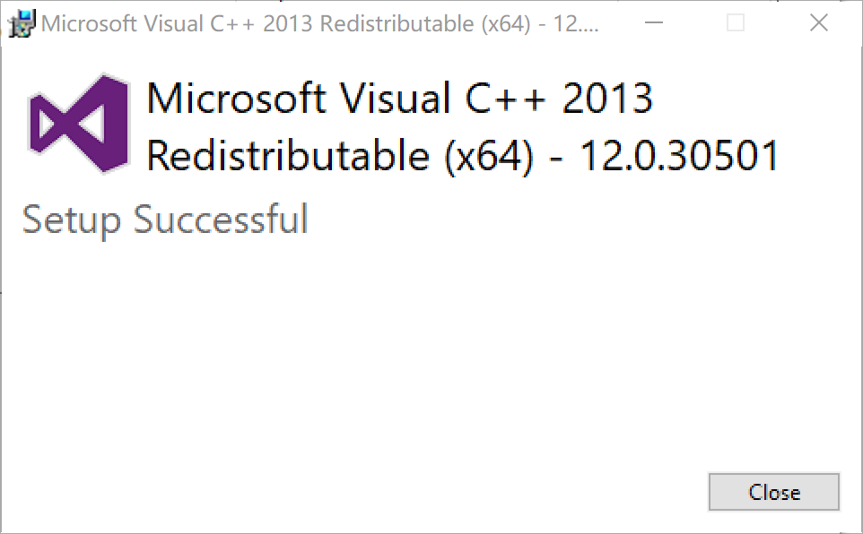
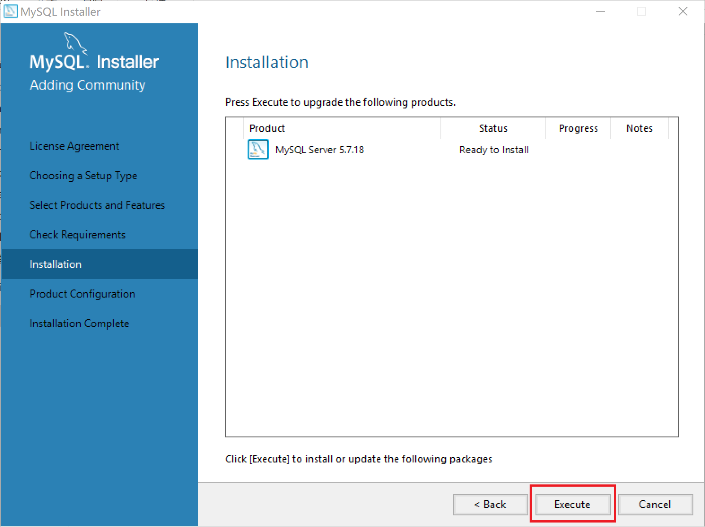
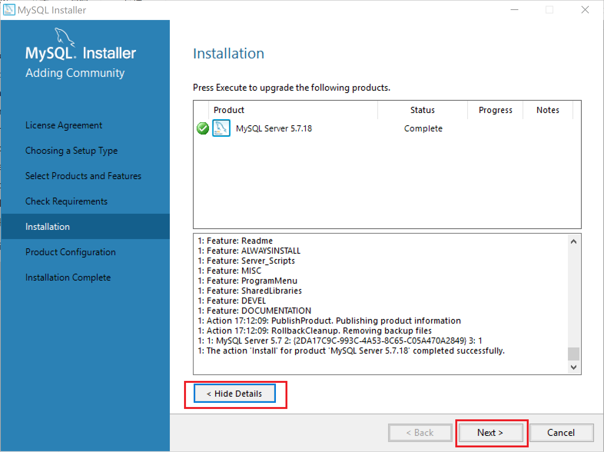
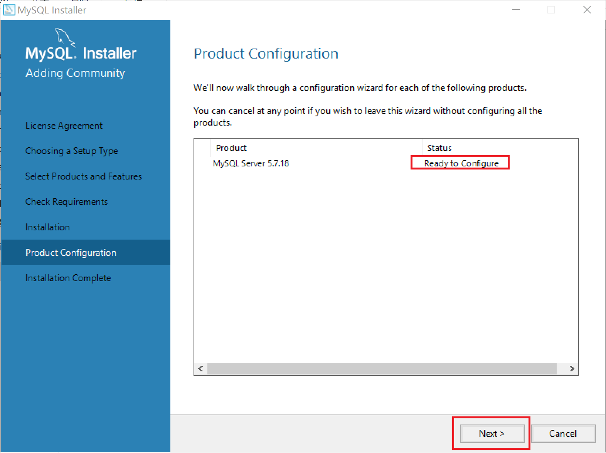

# MySQL服务器的安装
> MySQL和所有其它的DMBS产品一样都采用C/S构架.
>
>> 即Client/Server的客户端服务器构架.
>>
>> 1. SQL客户端软件向SQL服务器软件发送SQL查询命令.
>> 2. SQL服务器软件监听并接受响应，将收到的SQL查询命令编译并运行.
>> 3. 最后SQL服务器软件将查询结果返回给客户端.
>>
>>> 所以MySQL是一组成套软件，分为 **客户端和服务器端** 两组，其中：
>>>
>>> 1. 服务器端：包含数据存储、SQL编译&运行、数据安全&完整&一致、事物&权限控制等组件.
>>> 2. 客户端：主要是和服务器端的交互式工具，如数据可视化工具等，主要有两种形式，命令行界面和图形界面.
>>>    - 命令行界面的客户端在所有OS平台下统一称为 **mysql-client**.
>>>    - 而图形界面的客户端则多种多样，如： **MySQL-Workbench、SQLyog** 等.
>>>
>> - 因此MySQL服务器端安装完后，必须要将其 **作为服务启动**.
>>    - 为其分配特殊的OS用户身份，并以服务的身份启动.
>>
>>>
>>> - 现在不管是哪个OS平台下的MySQL版本，其 **服务端部分都默认包含了`命令行界面`的客户端组件** 了.
>>>   - 也就是说，只要安装服务器端部分也能实现和服务器端的交互了，只不过仅限于命令行.

<br><br>

## 目录

1. []()
2. []()

<br><br>

### 一、Ubuntu：
> 基于APT安装.

<br>

**1.&nbsp; 安装步骤：**

```Shell
# 1. 切换root身份
su - root

# 2. 检查并更新软件源
apt update

# 3. 安装服务器端部分（默认包含了命令行界面客户端部分）
apt install mysql-server
# 包中包含了
## 1. 服务器端组件：mysql-server-X.X.X & mysql-server-core-X.X.X
## 2. 命令行界面的客户端组件：mysql-client-X.X.X & mysql-client-core-X.X.X
# 在安装过程中会让您设定MySQL的root密码.
## 但如果不设定的话（直接回车略过），安装完毕后可以使用mysql_secure_installation命令完成.

# 4. 设定初始root密码（如果安装时没设定的话），以及删除测试数据库等
mysql_secure_installation

# 5. 登录并使用：可以在普通用户身份下登录并使用
## 由于apt install mysql-server在安装完毕后自动启动名为mysql的服务，因此可以直接登录并使用
$ mysql -u root -p
```

<br>

**2.&nbsp; MySQL服务的操作：** service命令

```Shell
service 服务的名称 操作类型
```

- 操作类型包括：

| 选项 | 说明 |
| --- | --- |
| start | 启动 |
| stop | 停止 |
| restart | 重启 |
| status | 查看状态 |

- 这里MySQL从5.0开始，默认在Linux中的服务名称为"mysql"（作为distribution的发布标准了）.
   - 因此，启动命令就是：**service mysql start**

<br><br>

### 二、Windows：

<br>

**1.&nbsp; 下载安装包：**

<br>

- 1. 在主页 [**https://www.mysql.com**](https://www.mysql.com) 上点击 **Downloads** 选项卡.



- 2. 接着在Downloads选项卡中单击 **Community** 子选项卡.
   - 学习MySQL就选择免费的Community版本.


- 3. 接着在Community的选项卡页面单击 **MySQL on Windows (Installer & Tools)** 入口.


- 4. 接下来选择 **MySQL Installer**，它包含了下面所有的MySQL在Windows平台下的产品，是一组集中安装软件.


<br>

- 5. 在Installer页面中下载 **.msi** 的MySQL **Windows Installer** 安装包.
   - 这里注意以下几点：
      1. 显示只有32位的安装包，但第一行已经注明了，其中同时包含了x86和x64两种版本，可以自由选择.
      2. 选择广泛推荐的GA版本.
      3. 存在web和非web两种安装方式（其中web的很小，只有十几MB）.
         - web是在线安装版，非web是离线安装版，一般选择离线安装版.
         - 这里直接给出离线安装版的链接：[**下载**](https://dev.mysql.com/downloads/file/?id=470091)


<br>

**2.&nbsp; 安装MySQL服务器：**

<br>

- 1. 打开之前下载下来的.msi安装包.


<br>

- 2. **同意协议** 并下一步.



<br>

- 3. 选择 **自定义安装** 并下一步.



<br>

- 4. 选择 **要安装的组件** 并下一步.
   - **在左侧选择要安装的组件** 后，点击中间的箭头（右表示添加，坐表示去掉）添加到 **右侧待安装一栏** 中.
   - 可以看到MySQL Windows Installer不仅包含服务器端部分，还包含其它好多组件：**x86和x64都有**
      1. 服务器部分.
      2. 数据库应用（客户端）：WorkBench、Shell、Utilities等.
      3. 各编程语言的接口驱动Connector.
      4. MySQL文档.



<br>

- 5. 提示需要安装Windows环境下的依赖库 **Microsoft Visual C++ 2013**，**点击执行** 并安装.





<br>

- 6. 依赖环境安装成功，回到之前的页面，点击下一步进入安装.


<br>

- 7. 点击执行安装（可以查看安装细节过程）.
   - 安装完毕后点击下一步进入提示配置的画面.
   - 再点下一步进行数据库配置.





<br>

**3.&nbsp; 配置数据库：**
