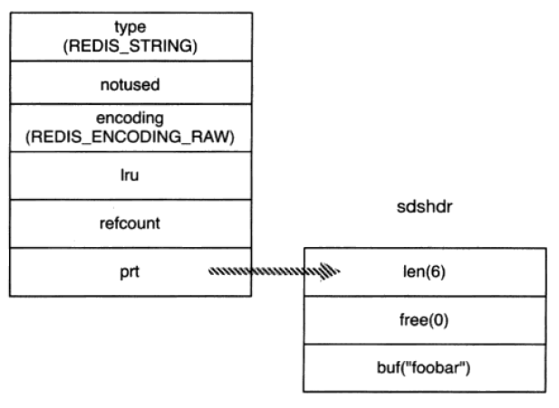
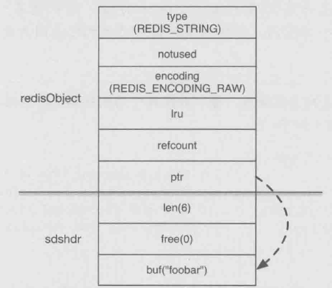
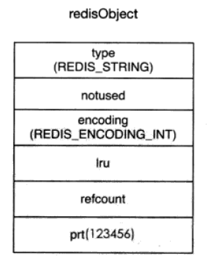
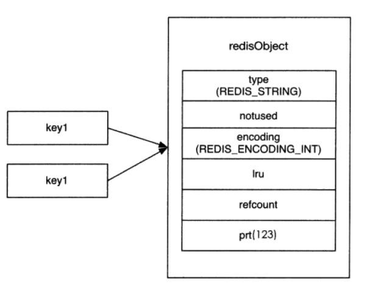

# 数据类型的内部编码 & string编码方案
> Redis节省内存空间的3种基本方法：
>
> 1. 精简键名：
>    - 键名就相当于编程语言中的对象名（变量名）.
>    - 虽然键名也需要存储在数据库中，但是没有原则的精简既不好维护（可读性差）并且容易命名冲突.
> 2. 精简键值：
>    1. 策略性精简：比如性别、是否在线等信息使用二进制位表来存储.
>    2. **数据结构上的优化：改变键值存储的内部编码（使用更加节省内存的数据结构）.**
>
> <br>
>
>> - 总体来说：精简键值更靠谱（毕竟数据内容是由键值展现的），键值的精简才是真正意义上的精简.

<br><br>

## 目录

1. [Redis的数据类型内部编码策略：双保险](#一redis的数据类型内部编码策略双保险--)
2. [内部编码方案表以及查询方式：object encoding命令](#二内部编码方案表以及查询方式object-encoding命令--)
3. [Redis的键和值的C语言存储结构体](#三redis的键和值的c语言存储结构体)
4. [string的3种编码方案](#四string的3种编码方案)

<br><br>

### 一、Redis的数据类型内部编码策略：双保险  [·](#目录)
> Redis为每种数据类型提供2种存储编码方案（其中string有3种）.
>
>> - 一种编码方案是牺牲空间换时间，另一种是牺牲时间换空间.

<br>

- 2种编码方案的适用场景：
   1. **牺牲空间换时间** 的编码方案：
      - 适用于 **数据量大，对时间复杂度要求很高** 的场景.
      - 如散列结构为了使数据查询等操作时间只有O(1)而使用hash表而占用大量空间.
   2. **牺牲时间换空间** 的编码方案：
      - 适用于 **数据量小且零散** 的场景.
      - 例如用数组存放散列，虽然操作的时间复杂度是O(n)，但由于数据量小导致O(1)并不会比O(n)有很高的性能提升.
         - 但是内存空间上比hash表节省了1倍还多！并且很紧凑.

<br>

- 2中编码方案的应用和切换：
   1. Redis可以智能地自动切换一个键值的内部编码方案.
   2. 只要对conf配置文件进行一定配置即可（设定切换的条件）.
      - 一般都是设定成：
         1. **当数据量小于某个临界值时使用时间换空间的方案.**
         2. **当数据量大于该临界值时自动切换成空间换时间的方案.**

<br><br>

### 二、内部编码方案表以及查询方式：object encoding命令  [·](#目录)

<br>

- Redis共有8中数据类型内部编码方案，可以使用 **object encoding命令** 查看：
   - 分别是：raw、int、embstr、hashtable、ziplist、linkedlist、intset、skiplist
      - 该命令返回这8个字符串中的1个.

```Shell
# 返回键值当前使用的编码方案
object encoding 键名
```

<br>

- 每种数据类型所采用的编码方案一览：

| 数据类型 | object encoding返回的编码方案 |
| --- | --- |
| string | `1) raw`<br>`2) int`<br>`3) embstr` |
| hash | `1) hashtable`<br>`2) ziplist` |
| list | `1) linkedlist`<br>`2) ziplist` |
| set | `1) hashtable`<br>`2) intset` |
| zset | `1) skiplist`<br>`2) ziplist` |

<br><br>

### 三、Redis的键和值的C语言存储结构体：[·](#目录)

<br>

- Redis的所有键值使用 **redisObject结构体** 存储：

```C
typedef struct redisObject { // 4 + 4 + 8 = 16字节
    // 1. 数据类型（4位，0.5字节）
      /*
       *  #define REDIS_STRING  0
       *  #define REDIS_LIST    1
       *  #define REDIS_SET     2
       *  #define REDIS_ZSET    3
       *  #define REDIS_HASH    4
       */
    unsigned type:4;

    // 2. 该字段无效，仅仅为了凑整空间而已（2位，0.25字节）
    unsigned notuse:2;

    // 3. 该键值当前使用的内部编码（8种中的1种），ZIPMAP没有用到（4位，0.5字节）
      /*
       *  #define REDIS_ENCODING_RAW        0
       *  #define REDIS_ENCODING_INT        1
       *  #define REDIS_ENCODING_HT         2
            // Redis 2.4及以前用ZIPMAP编码过hash的时间换空间方案
       *  #define REDIS_ENCODING_ZIPMAP     3
       *  #define REDIS_ENCODING_LINKEDLIST 4
       *  #define REDIS_ENCODING_ZIPLIST    5
       *  #define REDIS_ENCODING_INTSET     6
       *  #define REDIS_ENCODING_SKIPLIST   7
       *  #define REDIS_ENCODING_EMBSTR     8
       */
    unsigned encoding:4;

    // 4. OS LRU cache信息（22位，2.75字节）
    unsigned lru:22;

    // 5. 共享编码类型（int时才有效）的引用数量（4字节）
    int refcount;

    // 6. 指向数据真正的存储空间（64位系统，8字节）
    void *ptr;
} rboj;
```

<br>

- 键就是一个指向redisObject结构体的指针而已.
   - 但键名本身并非用redisObject存储，而是通过散列的方式存储的.

```C
key {
    struct redisObject* ptr;  // 指向一个object
    char name[];  // 存储键名
}
```

<br><br>

### 四、string的3种编码方案：[·](#目录)
> 无须自己配置，完全由Redis强行设定好的，只需记住规则就行.

<br>

**1.&nbsp; raw：**

<br>

- 使用sdshdr结构体存储string字符串.
   1. sds：simple dynamic string的缩写，即简单动态字符串.
   2. hdr：header的缩写，即该结构体只是string的头，头部仅仅存放长度、可用空间等信息，真正的body存放在buf所指向的内存空间中.

```C
struct sdshdr {
    int len;  // 当前字符串长度
    int free; // buff的剩余可用空间
    char buf[];  // 指向真正存放字符串内容的空间
}
```

<br>

- 存储结构的关系描述：
   1. 引用链：redisObject.ptr -> sdshdr.buff -> str_content
   2. raw键的总空间大小：sizeof(redisObject + sdshdr + str_content)

<br>

- 存储内容为'foobar'的示意图（`Set key foobar`）：



<br>

**2.&nbsp; embstr：**

> embeded string的缩写，即嵌入式string，体现出其存储结构更加紧凑.

<br>

- 是Redis 3.0的新特性，完全基于raw（raw的升级版），空间更加紧凑：
   1. redisObjet、sdshdr、buf完全连续.
   2. raw的话3者不连续，可以分布在不同的地方.
      - 最大的优点就是 **分配和释放内存空间从2次（raw）减少为1次（emstr）**.
         - 可以最大程度发挥OS cache的优势.
   3. 其余和raw完全一样，占用空间总大小都一样.

<br>

- **emstr和raw之间的转换条件：**
   1. 当键值总内容大小不超过39字节时默认采用embstr. （大于39字节自动转换成raw）
   2. 对embstr的键值使用append命令（动态增加buf空间）也会自动转换成raw.

<br>

- 存储内容为'foobar'的示意图（`Set key foobar`）：



<br>

**3.&nbsp; int：**

> 专门用于存储long范围之内的整数. （顾名思义int就是指整数）

<br>

1. 当存储的内容为 **64位有符号整数** 时（1个long，8字节），就直接用redisObjet.ptr本身来保存了.
2. 这样存储空间就只有1个sizeof(redisObjet)了，没有sdshdr和buf了！
   - 示意图：存储内容为'123456'（Set key 123456），刚好处于long的范围之内.



<br>

- 加速优化（int:share_0_9999）：启动时共享对象[0, 10000)
   - 即Redis服务器在启动时自动在内存中先创建[0, 9999]这1万个数字类型的redisObject了.
   - 后续如果创建了其它在该范围内的string键，则直接让key.ptr指向这些共享对象.
      - 每有一个其它key指向它，则redisObject.refcount就+1.
   - **共享对象方式存储的键值不消耗内存空间（0字节）.**
      - **因此存储对象ID这种小数字是非常非常节省空间的！**
   - 示意图：设置2个内容为123的键（123在[0, 9999]的范围内，因此使用共享对象）. （**refcount = 2**）



> 如果设置了maxmemory参数（Redis最大可用空间）将会关闭int共享对象的功能.
>
> - 因为此时每个键值都需要监控redisObject.lru信息.
