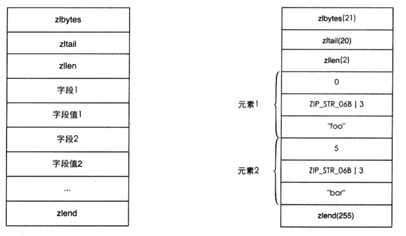

# ziplist & intset
> 1. ziplist是一种用可变数组实现的高度紧凑的编码格式.
>    - 应用于hash、list、zset的时间换空间方案.
> 2. intset只应用于set存储 **小&整数**.
>    - 就是8字节数组，高度紧凑，时间换空间方案.
>
>> - 两者都采用数组实现，因此插入、删除元素等都需要大规模挪动.
>>    - 所以只能在元素数量较少的情况下使用.

<br><br>

## 目录

1. [ziplist内部存储结构](#一ziplist内部存储结构)
2. [每个ziplist元素的存储结构](#二每个ziplist元素的存储结构)
3. [ziplist编码hash类型的示意图](#三ziplist编码hash类型的示意图)
4. [intset的结构](#四intset的结构)

<br><br>

### 一、ziplist内部存储结构：[·](#目录)

<br>

- **变量名的前缀zl是ziplist的缩写.**
   - redisObject.ptr就指向下面的结构.

| 地址（从上往下，从低到高）| 字节数:简名 | 说明 |
| :---: | --- | --- |
| uint**32**_t zlbytes | **4**: total_size | `整个ziplist占用的字节数` |
| uint**32**_t zltail | **4**: last_ele_offset | `1) 到最后一个元素的偏移量`<br>`2) 可以快速操作尾端（list专用）` |
| uint**16**_t zllen | **2**: ele_num | `元素的数量` |
| **元素0** | `1) 大小不固定` | `1) 存放list元素时和list的元素一一对应` |
| **元素1** | `2) 根据存储的数据类型决定` | `2) 存放hash元素时前一个是字段名后一个是字段值` |
| ... | `3) hash、list、zset元素都可以存` | `3) 存放zset元素时前一个是元素值后一个是分数` |
| uint**8**_t | **1**: end_sign | `结束标致，**恒为255**` |

- 对于hash和zset而言，查找元素时都是一次跳过一个元素以保证只查找字段名以及元素值.

<br><br>

### 二、每个ziplist元素的存储结构：[·](#目录)

<br>

| 地址（从上往下，从低到高）| 说明 | 字节数 |
| :---: | --- | --- |
| prev_ele_size | `1) 前一个元素的字节数`<br>`2) 以实现倒序查找` | `prev_ele_size < 254? 1: 5` |
| ele_encoding<br>ele_size | `1) 当前元素的编码方案`<br>`2) 当前元素的字节数` | `case ele_size:`<br>`1) < 64: 1`<br>`2) < 16384: 2`<br>`3) 5` |
| ele_content | `元素的实际内容` | `1) 如果可以转换成数字的话则会采用数字编码压缩空间`<br>`2) 会在ele_encoding&ele_size上体现出来` |

<br><br>

### 三、ziplist编码hash类型的示意图：[·](#目录)

<br>

- 假设`hSet hkey foo bar`：



<br><br>

### 四、intset的结构：[·](#目录)
> set采用该编码方案的条件：
>
> 1. 所有元素均为整数.
> 2. 数量小于配置值.
>
>> - 特点是不可逆：
>>    1. 一旦不满足上述条件就转换成hashtable的编码方案.
>>    2. 一旦变成hashtable后就无法再自动转换成intset了.
>>       - 否则每删除一个元素都需要查看所有元素是否满足条件.
>>       - 这样的话删除元素等操作的复杂度为O(n).

<br>

- redisObject.ptr就指向该结构体：

```C
typedef struct intset {
    // 1. contents中每个元素的编码方案
      /*
       *  - 有INTSET_ENC_INT16、INTSET_ENC_INT32、INTSET_ENC_INT64三种
       *  - 即每个元素分别都为2字节、4字节、8字节
       *
       *  1. 一开始默认是2字节.
       *  2. 如果后来新加入的整数2字节放不下就升级（4字节或者8字节）.
       *    - 升级时会把之前所有元素都升级成4字节或8字节.
       *  3. 如果8字节也装不下就整个转换成hashtable编码方案了.
       */
    uint32_t encoding;

    // 2. 目前contents中存放的整数的个数
    uint32_t length;

    // 3. malloc的动态空间，存放整数内容
      // 由于是数组存放，因此是有序的
    int8_t contents[];

} intset;
```
